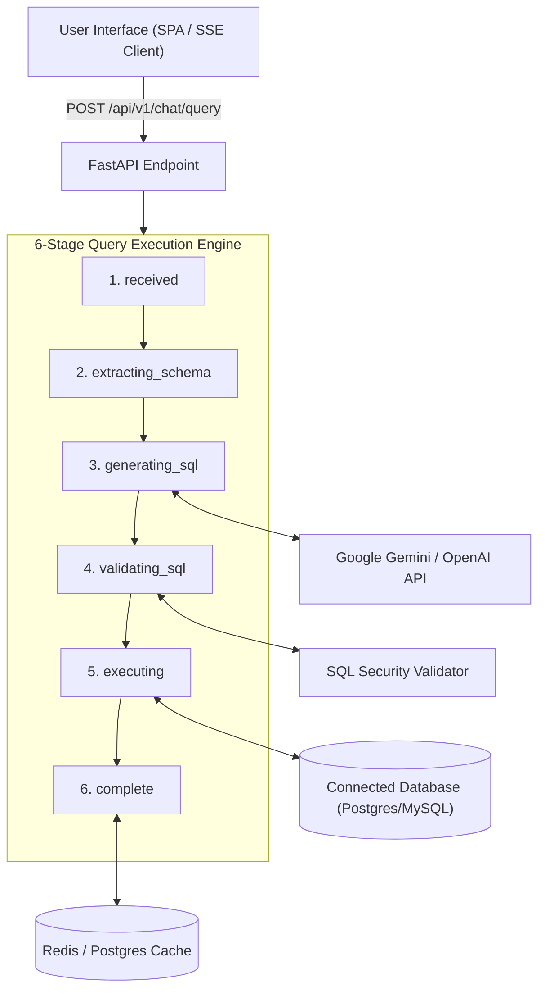

# 🤖 DB-ChatBot

**Enterprise-grade Natural Language to SQL (NL-to-SQL) database query platform.**

DB-ChatBot lets users query relational databases using plain English. It translates conversational questions into safe, validated SQL, executes them in a read-only sandbox, and streams live progress back to the client in real time.

---

## ✨ Key Features

- 🗣️ **Natural language querying** — ask questions in plain English, get SQL-backed answers
- ⚡ **Real-time streaming** — live query progress via Server-Sent Events (SSE)
- 🛡️ **8-layer SQL security validator** — every AI-generated query is scanned before execution
- 🔌 **Multi-database support** — PostgreSQL, MySQL, SQLite, MSSQL, Oracle
- 🧠 **Dual LLM providers** — Google Gemini and OpenAI, hot-swappable
- 🚀 **Smart caching** — Redis-backed semantic + exact query caching (<5ms on repeat queries)
- 🔄 **Self-correcting queries** — failed SQL is automatically refined by the LLM (up to 2 retries)
- 🐳 **Fully containerized** — one-command startup with Docker Compose
- ✅ **133 automated tests** — 100% pass rate across unit and integration suites

---

## 🏗️ Architecture



Every query flows through six asynchronous stages, each broadcasting a live status update to the client:

| Stage | Name | What Happens |
|---|---|---|
| 1 | `received` | Validates request parameters and the active connection UUID |
| 2 | `extracting_schema` | Extracts live schema metadata (tables, columns, foreign keys), TTL-cached |
| 3 | `generating_sql` | Prompts the LLM with database context to generate structured JSON SQL |
| 4 | `validating_sql` | Runs the query through the 8-layer security scanner with self-correction |
| 5 | `executing` | Executes validated SQL inside a read-only transaction with strict timeouts |
| 6 | `complete` | Formats results, records token metrics, persists chat history |

SSE payloads follow the format:
```
data: {"stage": "...", "data": ...}
```

---

## 🧰 Tech Stack

| Layer | Technology |
|---|---|
| **Backend** | Python 3.12+, FastAPI (async) |
| **ORM** | SQLAlchemy 2.0 (async) via `asyncpg` / `psycopg2` |
| **Databases** | PostgreSQL, MySQL, SQLite, MSSQL, Oracle |
| **LLM Providers** | Google Gemini (`gemini-flash-lite-latest`), OpenAI (`gpt-4o-mini`) |
| **Caching** | Redis 7, with PostgreSQL fallback + vector similarity search |
| **Migrations** | Alembic |
| **Frontend** | HTML5, vanilla CSS, JS (ES6+) — single-page app with live SSE progress |
| **Containerization** | Docker & Docker Compose |
| **Testing** | pytest, pytest-asyncio (133 tests) |

---

## 🛡️ SQL Security Model

Every AI-generated query passes through **8 strict validation layers** before it ever touches your database:

1. **SELECT Enforcement** — blocks `INSERT`, `UPDATE`, `DELETE`, `DROP`, `ALTER`, `TRUNCATE`
2. **Single Statement Enforcement** — blocks `;` statement chaining
3. **System Table Protection** — blocks access to `pg_catalog`, `information_schema`
4. **System Function Protection** — blocks `pg_sleep`, `version()`, `current_setting`
5. **SQL Injection Mitigation** — blocks `UNION ALL`, boolean tautologies (`'1'='1'`)
6. **Comment Stripping** — strips `--` and `/* */` to remove hidden injection vectors
7. **Query Complexity Limits** — enforces subquery nesting depth limits
8. **Read-Only Isolation** — wraps execution in `SET TRANSACTION READ ONLY`

If a query fails validation, the error is fed back to the LLM for up to **2 automatic self-correction attempts** before failing out.

---

## 📁 Project Structure

```
DB-ChatBot/
├── app/
│   ├── ai/              # NL-to-SQL logic (LLM client, prompt templates, schema extractor, validator)
│   ├── api/              # FastAPI routers & v1 endpoints (chat, database, query, cache, health)
│   ├── cache/            # Semantic query caching & similarity search logic
│   ├── core/             # Application settings, security, and exceptions
│   ├── db/               # SQLAlchemy session setup, engine management, migrations
│   ├── models/            # ORM models (Connection, ChatSession, ChatMessage, Cache)
│   ├── repositories/     # Data access object (DAO) repositories
│   ├── schemas/           # Pydantic request/response validation schemas
│   ├── services/          # Business logic (stream_service, database_service, execution_service)
│   ├── static/            # SPA frontend (index.html, style.css, app.js)
│   └── main.py            # FastAPI application entrypoint
├── alembic/               # Database migration scripts
├── docker-compose.yml     # Multi-container orchestration config
├── Dockerfile              # Multi-stage Docker build definition
├── pytest.ini              # Pytest configuration
├── requirements.txt        # Python dependencies
└── tests/                  # Unit & integration test suite (133 tests)
```

---

## 🚀 Getting Started

### Prerequisites

- Docker & Docker Compose
- A Google Gemini and/or OpenAI API key

### Installation

```bash
# Clone the repository
git clone https://github.com/<your-org>/DB-ChatBot.git
cd DB-ChatBot

# Copy and configure environment variables
cp .env.example .env
# Edit .env and add your LLM API keys, database credentials, etc.

# Start all services (App, Postgres, Redis)
docker compose up --build
```

The app will be available at `http://localhost:8000`. API documentation (Swagger) is available at `http://localhost:8000/docs`.

### Environment Variables

| Variable | Description |
|---|---|
| `GEMINI_API_KEY` | Google Gemini API key |
| `OPENAI_API_KEY` | OpenAI API key |
| `LLM_PROVIDER` | Active provider (`gemini` or `openai`) |
| `LLM_MODEL` | Model ID, e.g. `gemini-flash-lite-latest`, `gpt-4o-mini` |
| `DATABASE_URL` | Metadata store connection string (PostgreSQL) |
| `REDIS_URL` | Redis connection string |

> ⚠️ If you're on Gemini's **free tier**, note that request quotas are tracked per Google Cloud project and reset daily. `gemini-flash-lite-latest` has the highest free-tier request ceiling of the Gemini model family, making it the recommended default for high-volume NL-to-SQL workloads.

---

## 🔌 API Usage

Submit a natural language query and stream the results:

```bash
curl -N -X POST http://localhost:8000/api/v1/chat/query \
  -H "Content-Type: application/json" \
  -d '{
        "connection_id": "<your-connection-uuid>",
        "question": "Show me the top 10 customers by total revenue"
      }'
```

The response streams as Server-Sent Events, one per pipeline stage, ending with a `complete` event containing the result table, generated SQL, reasoning, and token usage metrics.

Full interactive API reference is available via Swagger UI at `/docs` once the app is running.

---

## 🧪 Testing

```bash
# Run the full test suite
pytest

# Run with coverage
pytest --cov=app tests/
```

Current coverage: **133 tests, 100% pass rate**, spanning:
- `test_stream_query.py` — SSE pipeline behavior
- `test_ai_service.py` — LLM integration & structured output parsing
- `test_cache.py` — Redis/Postgres caching logic
- `test_chat_sessions.py` — chat session persistence
- `test_database_connection.py` — multi-engine DB connectivity

---

## 🗺️ Roadmap Ideas

- [ ] Additional LLM provider support (Anthropic, local models)
- [ ] Role-based access control per database connection
- [ ] Query result export (CSV / Excel)
- [ ] Visual query builder fallback for low-confidence generations

---

## 📄 License

Add your license here (e.g. MIT, Apache 2.0).

---

## 🤝 Contributing

Contributions are welcome! Please open an issue to discuss significant changes before submitting a pull request. Make sure `pytest` passes locally before opening a PR.
